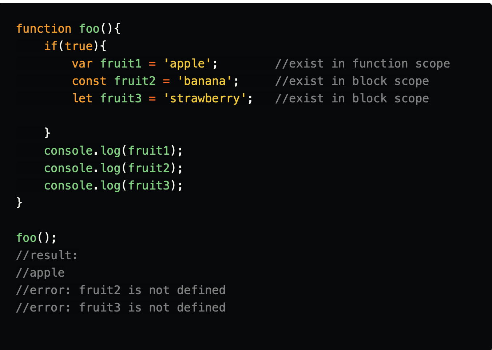

## Working with ES6

### Import and Export
[ES6 Modules and How to Use Import and Export in JavaScript](https://www.digitalocean.com/community/tutorials/js-modules-es6)

---
### Scope 
- **Global Scope**
- **Local Scope** : can be divided into function scope and block scope.
  + **Function Scope** : Variable declared within the function
  + **Block Scope** : area within if, switch conditions or for and while loops. Whenever you see **{Curley brackets}** , it is a block scope.In ES6, const and let keywords allow developers to declare variables in the block scope, which means those variables exist only within the corresponding block. 
  *let* and *const* are block scope variables. *var* is globally scoped or function scoped.
  

  ---

  ### Arrow Functions
  + An arrow function expression has a shorter syntax than a function expression and does not have its own this, arguments, super, or new.
  + An arrow function can be used with array methods like *map*, *filter*, *reduce*
  + **this** Binding with Arrow Functions
    - Arrow functions do not bind their own **this**.Rather, **this** in an arrow function always refers to its parent's this. Arrow functions inherit the scope of their parent.

    In ES5, we use **this** either by storing  parents **this** in a variable and use it, or we **bind(this)** ot the function to use it.
  +  References:
      [ES6 arrow functions Examples and Usage](https://www.digitalocean.com/community/tutorials/getting-started-with-es6-arrow-functions-in-javascript)
      [ES5 functions and ES6 arrow functions explaination on binding](https://dev.to/sarah_chima/arrow-functions-in-es6-24)

